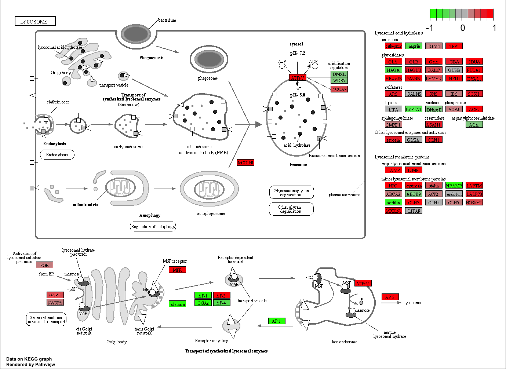

#Section 1. Differential Expression Analysis

```{r}
library(DESeq2)
```

```{r}
metaFile <- "GSE37704_metadata.csv"
countFile <- "GSE37704_featurecounts.csv"

# Import metadata and take a peak
colData = read.csv(metaFile, row.names=1)
head(colData)
```

```{r}
# Import countdata
countData = read.csv(countFile, row.names=1)
head(countData)
```

We need to remove the first countData\$length column:

```{r}
countData <- as.matrix(countData[,-1])
head(countData)
```

Better, but we can get rid of 0 entries to further clean up the data

```{r}
# Filter count data where you have 0 read count across all samples.

countData = countData[rowSums(countData)!=0,]
head(countData)
```

The data now loooks ready to analyze. First, we will set up a DESeqDataSet object similar to last session:

```{r}
dds = DESeqDataSetFromMatrix(countData=countData,
                             colData=colData,
                             design=~condition)
dds = DESeq(dds)
```

```{r}
dds
```

Now, let's get start digging into the results for HoxA1 KD vs control RNA:

```{r}
res = results(dds)
summary(res)
```

Seems roughly 27% of the genes are upregulated and 28% upregulated with a default 0.1 pValue cutoff.

Let's make a volcano plot to visualize this better. We can use base r `plot()`

```{r}
plot( res$log2FoldChange, -log(res$padj) )
```

Let's start by adding some color and labels:

```{r}

# Make a color vector for all genes
mycols <- rep("gray", nrow(res) )

# Color red the genes with absolute fold change above 2
mycols[ abs(res$log2FoldChange) > 2 ] <- "red"

# Color blue those with adjusted p-value less than 0.01
#  and absolute fold change more than 2
inds <- (res$pvalue <0.01) & (abs(res$log2FoldChange) > 2 )
mycols[ inds ] <- "blue"

plot( res$log2FoldChange, -log(res$padj), col=mycols, xlab="Log2(FoldChange)", ylab="-Log(P-value)" )

```

Looking good! Time to add gene annotation.

Since we mapped and counted against the Ensembl annotation, our results only have information about Ensembl gene IDs. However, our pathway analysis downstream will use KEGG pathways, and genes in KEGG pathways are annotated with Entrez gene IDs. So lets add them as we did the last day.

```{r}
library("AnnotationDbi")
library("org.Hs.eg.db")

columns(org.Hs.eg.db)

res$symbol = mapIds(org.Hs.eg.db,
                    keys=row.names(res), 
                    keytype="ENSEMBL",
                    column="SYMBOL",
                    multiVals="first")

res$entrez = mapIds(org.Hs.eg.db,
                    keys=row.names(res),
                    keytype="ENSEMBL",
                    column="ENTREZID",
                    multiVals="first")

res$name =   mapIds(org.Hs.eg.db,
                     keys=row.names(res),
                     column="GENENAME",
                     keytype="ENSEMBL",
                     multiVals="first")

head(res, 10)
```

Finally for this section let's reorder these results by adjusted p-value and save them to a CSV file in your current project directory:

```{r}
res = res[order(res$pvalue),]
write.csv(res, file="deseq_results.csv")
```

#Section 2. Pathway Analysis

Here we are going to use the gage package for pathway analysis. Once we have a list of enriched pathways, we're going to use the pathview package to draw pathway diagrams, shading the molecules in the pathway by their degree of up/down-regulation.

```{r}
library(pathview)
```

```{r}
library(gage)
library(gageData)

data(kegg.sets.hs)
data(sigmet.idx.hs)

# Focus on signaling and metabolic pathways only
kegg.sets.hs = kegg.sets.hs[sigmet.idx.hs]

# Examine the first 3 pathways
head(kegg.sets.hs, 3)
```

The main gage() function requires a named vector of fold changes, where the names of the values are the Entrez gene IDs.

Note that we used the mapIDs() function above to obtain Entrez gene IDs (stored in `res$entrez`) and we have the fold change results from DESeq2 analysis (stored in `res$log2FoldChange`).

```{r}
foldchanges = res$log2FoldChange
names(foldchanges) = res$entrez
head(foldchanges)
```

Now to run the gage pathway analysis:

```{r}
# Get the results
keggres = gage(foldchanges, gsets=kegg.sets.hs)

attributes(keggres)

head(keggres$less)
```

Now, let's try out the pathview() function from the pathview package to make a pathway plot with our RNA-Seq expression results shown in color. To begin with lets manually supply a pathway.id (namely the first part of the "hsa04110 Cell cycle") that we could see from the print out above.

```{r}
pathview(gene.data=foldchanges, pathway.id="hsa04110")
```


You can play with the other input arguments to pathview() to change the display in various ways including generating a PDF graph. For example:

```{r}
# A different PDF based output of the same data
pathview(gene.data=foldchanges, pathway.id="hsa04110", kegg.native=FALSE)
```


Let's pull out the top 5 upregulated pathways:

```{r}
## Focus on top 5 upregulated pathways here for demo purposes only
keggrespathways <- rownames(keggres$greater)[1:5]

# Extract the 8 character long IDs part of each string
keggresids = substr(keggrespathways, start=1, stop=8)
keggresids

```

Let's plot these pathways:

```{r}
pathview(gene.data=foldchanges, pathway.id=keggresids, species="hsa")
```

[1] "hsa04640" "hsa04630" "hsa00140" "hsa04142" "hsa04330"




Let's do the same for the top 5 downregulated pathways

```{r}
## Focus on top 5 upregulated pathways here for demo purposes only
downpathways <- rownames(keggres$lesser)[1:5]

# Extract the 8 character long IDs part of each string
downids = substr(keggrespathways, start=1, stop=8)
downids
```

```{r}
pathview(gene.data=foldchanges, pathway.id=downids, species="hsa")
```


#Section 3. Gene Ontology (GO)

We can also do a similar procedure with gene ontology. Similar to above, go.sets.hs has all GO terms. go.subs.hs is a named list containing indexes for the BP, CC, and MF ontologies. Let’s focus on BP (a.k.a Biological Process) here.

```{r}
data(go.sets.hs)
data(go.subs.hs)

# Focus on Biological Process subset of GO
gobpsets = go.sets.hs[go.subs.hs$BP]

gobpres = gage(foldchanges, gsets=gobpsets, same.dir=TRUE)

lapply(gobpres, head)
```

#Section 4. Reactome Analysis

```{r}
sig_genes <- res[res$padj <= 0.05 & !is.na(res$padj), "symbol"]
print(paste("Total number of significant genes:", length(sig_genes)))
```


```{r}
write.table(sig_genes, file="significant_genes.txt", row.names=FALSE, col.names=FALSE, quote=FALSE)
```
We analyze this file "significant_genes.txt" with the reactome website

## Q: What pathway has the most significant “Entities p-value”? Do the most significant pathways listed match your previous KEGG results? What factors could cause differences between the two methods?

Endosomal/Vacuolar pathway, Cell cycle,(Mitotic), and Mitotic prometaphase. They generally seem to match the KEGG results -M phase cell cycle is both listed, as is endosomal vacuolar pathway(which is listed in KEGG as organelle fisison). There are some minor differnces, but these are likely just due to small differences in how the two methods initially anotated their genes.


```{r}

```

